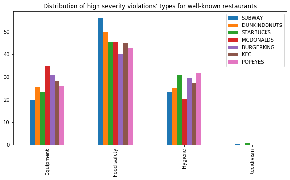
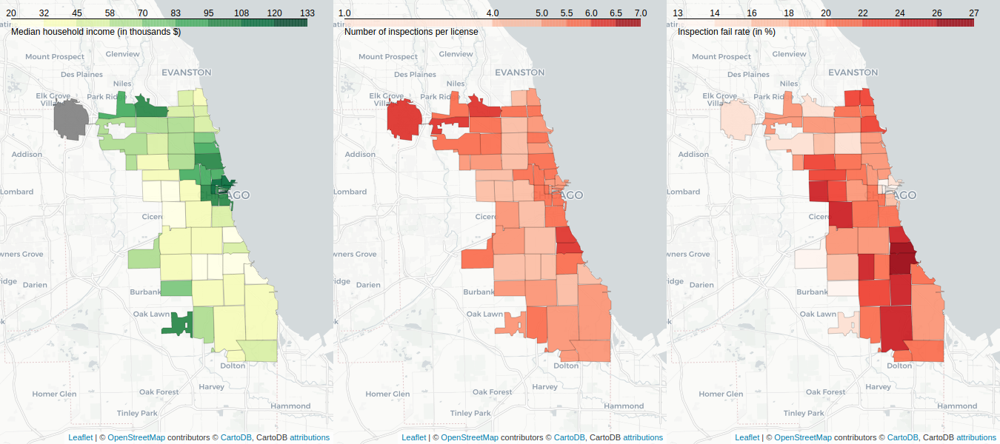

# Part 1 #

 
## Where do I need to go?  

Sometimes, we just don't want to go far away to enjoy a meal. We want to get out of bed, go outside and take a burger at the closest street block without worrying about transportation. We will see in this part that not all districts are equal regarding inspections and their results. Latter on, we will focus on some franchises as those also have pretty different results depending on where they are located in Chicage.  

### The socio-economic factor  

Chicago suffers a clear wealth divide with some district being largely poorer than teir neighboors. This can be observed with the North and North-East districts that are way richer than the West and South side of Chicago. We used the median household income as a wealth indicator to see if there is a correlation between the wealth and the overall restaurant inspections' results.  
To visualize this, we put side by side the districts' median income, their average inspections per restaurant (from 2011 to 2017) and the average inspection fail rate of these same restaurants.  

#### IMAGE INCOME->INSPECTION/LICENSE->FAILRATE  
We clearly see a domino effect between these different metrics. Especially, lower income districts' restaurants may face less inspections. And this lower amount of inspections leads surely to more failures as restaurants are left alone longer without control.  
